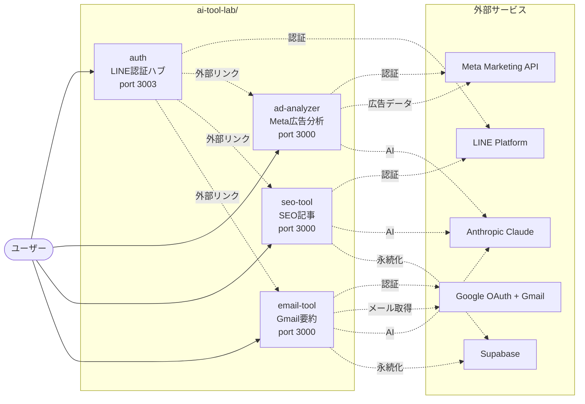
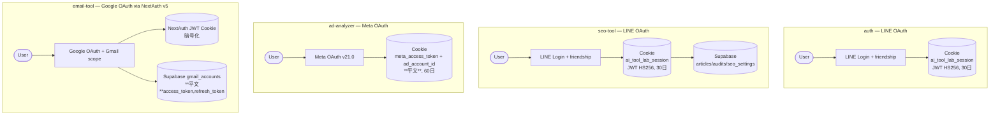
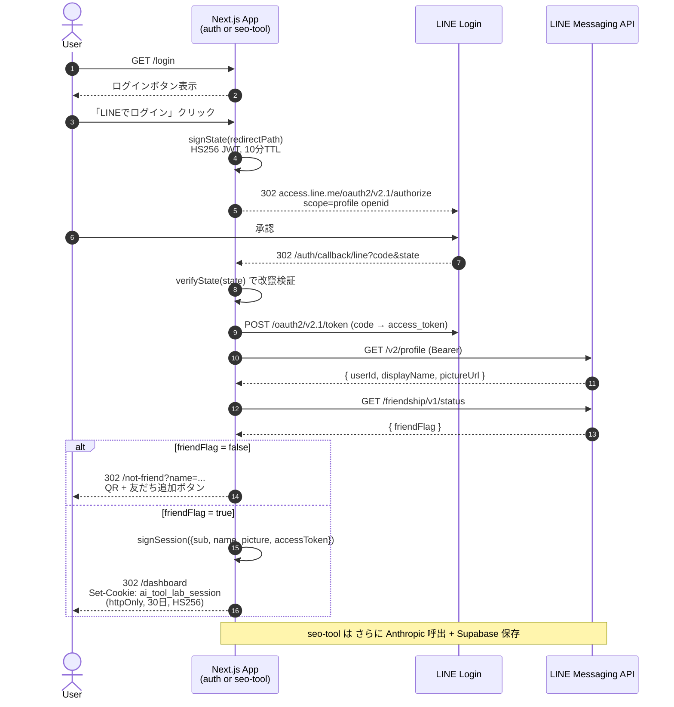
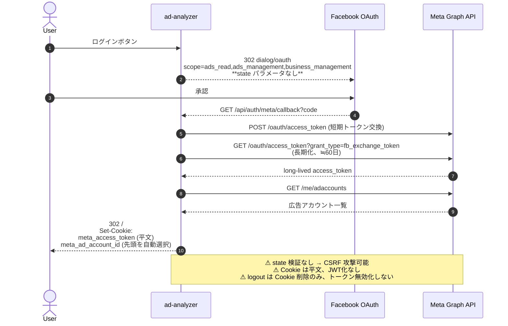
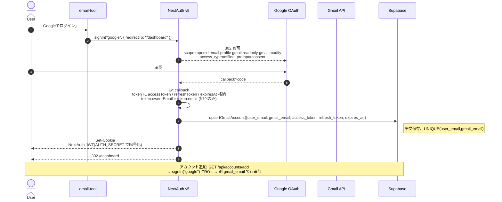
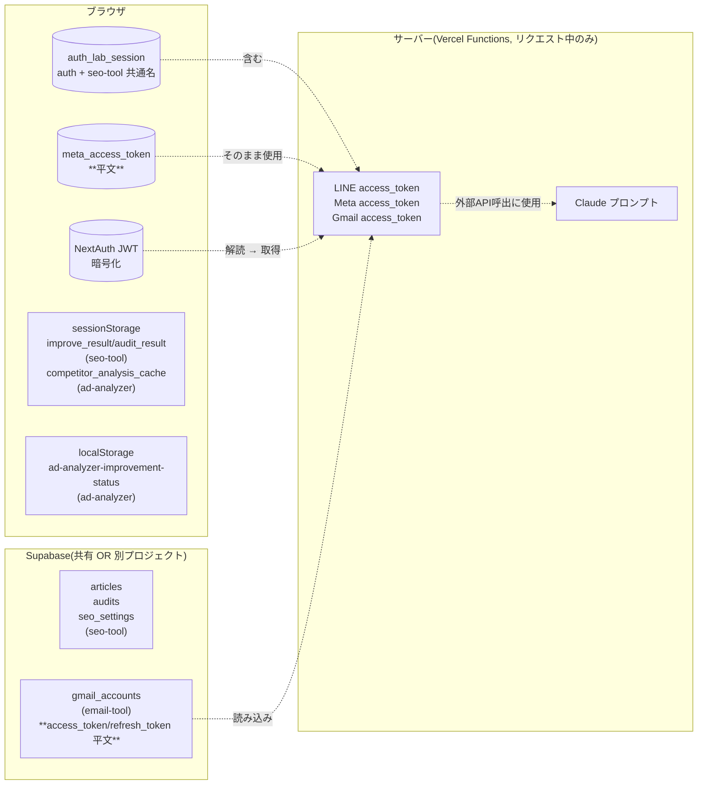
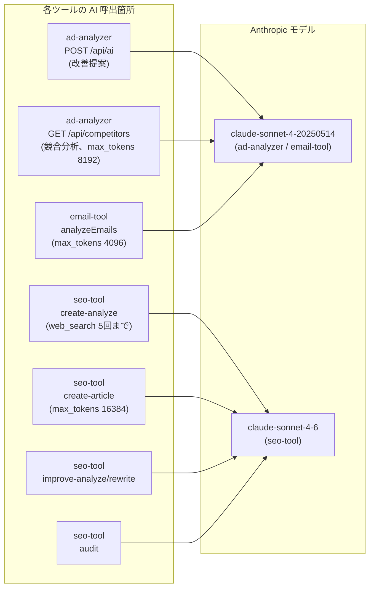
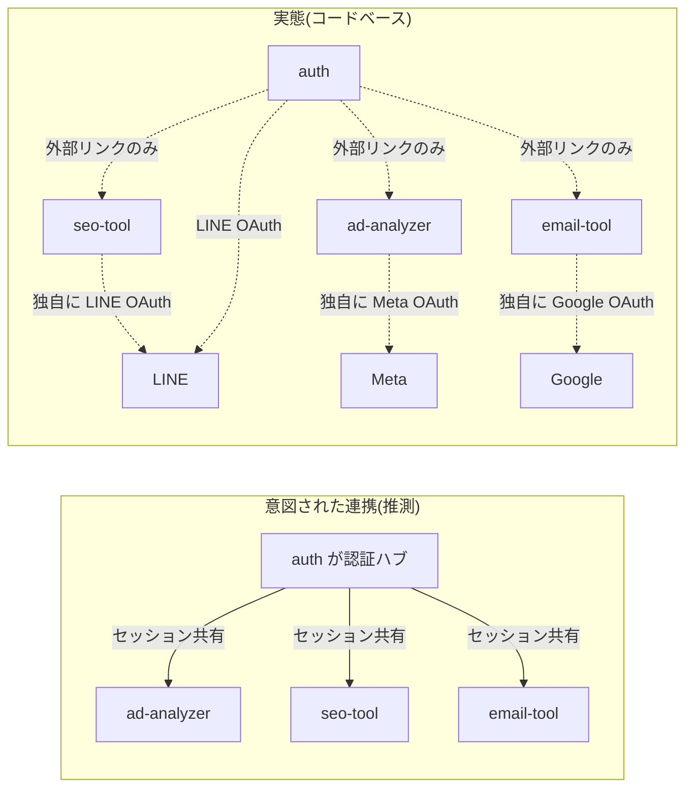

# AI Tool Lab — システム全体アーキテクチャ

4プロジェクトの相関関係、認証フロー、データ保存先、外部API依存を図示します。
詳細仕様は各プロジェクトの README とサブディレクトリ内 `OVERVIEW.md` を参照。

---

## 1. プロジェクト相関図(全体俯瞰)

ユーザーから見た4ツールと外部サービスの関係。

> ⚠ **`auth` ハブと3ツールはコードレベルで連携していません**。`auth/dashboard` の「ツールを開く」ボタンは外部リンクとして別タブを開くだけで、各ツールへ認証情報は渡りません。3ツールはそれぞれ独自に認証を持ちます。

---

## 2. 認証パターン比較(横並び)

各ツールがどの ID プロバイダを使ってどこにセッションを保存するか。

注目点:

- **`auth` と `seo-tool` は同じ Cookie 名 `ai_tool_lab_session` を使う** — `SESSION_SECRET` を共有していれば理論上は相互認証できるが、現状そう運用されているかは未確認
- **ad-analyzer のみ平文 Cookie + 暗号化なし** — セキュリティリスク
- **email-tool は NextAuth + Supabase の二重保存** — 不整合の可能性あり

---

## 3. LINE OAuth フロー(auth と seo-tool が共有する仕組み)

---

## 4. Meta OAuth フロー(ad-analyzer 専用、CSRF対策**未実装**)

---

## 5. Gmail OAuth フロー(email-tool 専用、NextAuth v5 経由)

---

## 6. データ保存先(全プロジェクト統合)

注目点:

- **DB に永続化されるトークンは email-tool のみ**(Gmail API は refresh_token が必須なため)
- **ad-analyzer は永続化なし** → ブラウザを閉じても再ログインせずに済むが、平文 Cookie のリスクあり
- **seo-tool の articles / audits は Supabase 永続化** だが、認証情報自体は Cookie のみ

---

## 7. AI モデル使用マップ

> モデル名が **ツール間で揃っていない**(`-20250514` vs `-4-6`)。プロジェクトごとに別タイミングでハードコードされた可能性。

---

## 8. ツール間依存図(意図された連携 vs 実態)

ギャップの原因と影響:

- 各ツールがそれぞれ独立した OAuth フローを持つため、**ユーザーは4回ログインが必要**(LINE x2、Meta x1、Google x1)
- `auth` ハブの `TOOL_API_SECRET` env 変数は `.env.example` に存在するが、コード内で参照されていない → 「各ツールから認証ハブへ契約状態を問い合わせる」設計の名残と推測
- 認証情報が**ツールごとに分散**しているため、ハブで一括ログアウトしても各ツールのセッションは生き残る

---

## 9. 凡例

| 記号 | 意味 |
|---|---|
| 実線矢印(→) | HTTP リクエスト・関数呼び出し(同期的依存) |
| 点線矢印(-.-> ) | 外部サービス通信 / 影響関係 |
| 二重円(`actor`) | ヒトのユーザー |
| `[(...)]` | データストア・永続化要素 |
| `subgraph` | 同一の信頼境界・物理境界に属するもの |

---

## 10. 改善優先度(プロジェクト横断)

| # | 問題 | 該当ツール | 緊急度 |
|---|---|---|:---:|
| 1 | OAuth `state` 未使用(CSRF) | ad-analyzer | 🔴 |
| 2 | Anthropic 呼出に認証チェックなし(課金 DoS) | ad-analyzer (`/api/ai`, `/api/competitors`) | 🔴 |
| 3 | アクセストークン平文 Cookie | ad-analyzer | 🔴 |
| 4 | アクセストークン平文 Supabase | email-tool | 🔴 |
| 5 | DELETE /api/accounts 所有権チェックなし(IDOR) | email-tool | 🔴 |
| 6 | SSRF — 任意URL fetch | seo-tool (`improve-analyze`, `audit`) | 🟡 |
| 7 | Meta API レート制限ヘッダ未読 | ad-analyzer | 🟡 |
| 8 | キャッシュ層が無く外部API毎回叩く | 全ツール | 🟡 |
| 9 | RLS 無効化 + service_role 直叩き | seo-tool, email-tool | 🟡 |
| 10 | プロンプトキャッシュ未使用(コスト) | email-tool, seo-tool | 🟢 |
| 11 | リフレッシュトークン管理に問題(`expires_at` 更新漏れ) | email-tool | 🟢 |

詳細は各プロジェクトの README の「⚠ 既知の問題」セクションを参照。

---

## 11. 認証ハブと3ツールを統合するなら(設計提案)

現状の独立構成から、`auth` を真の認証ハブにするなら以下が必要:

1. `auth` 側で各ツールへの「ワンタイムトークン」を発行する API(`POST /api/issue-tool-token`)
2. 各ツールはハブの `GET /api/verify-tool-token?token=...` を叩いて検証
3. ハブの `SESSION_SECRET` を **JWKS エンドポイントで公開**(共通鍵共有でなく公開鍵検証へ)
4. ハブの `/dashboard` から各ツールへ遷移する際にワンタイムトークンを付与
5. 各ツールは初回アクセス時にトークンを検証し、自前のセッションを発行

この設計を入れない限り、ユーザーは引き続き各ツールごとに OAuth ログインを繰り返す必要があります。

---

## 12. ドキュメント参照

- 全体README: [`README.md`](./README.md)
- 各プロジェクト:
  - [`auth/README.md`](./auth/README.md) / [`auth/OVERVIEW.md`](./auth/OVERVIEW.md) / [`auth/ARCHITECTURE.md`](./auth/ARCHITECTURE.md)
  - [`ad-analyzer/README.md`](./ad-analyzer/README.md) / [`ad-analyzer/docs/manual.md`](./ad-analyzer/docs/manual.md)
  - [`seo-tool/README.md`](./seo-tool/README.md)
  - [`email-tool/README.md`](./email-tool/README.md) / [`email-tool/manual.md`](./email-tool/manual.md)
