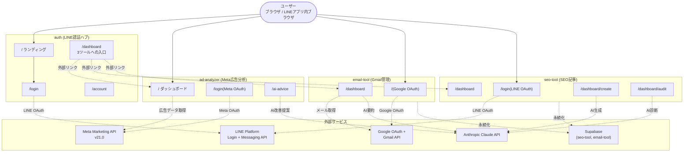

# AI Tool Lab — マルチプロジェクト・モノレポ

「AIツールラボ」プロジェクト群を1つのフォルダ配下にまとめたもの。
4つのリポジトリで構成され、それぞれが独立した Next.js 16 アプリケーションです。

---

## 構成プロジェクト

| プロジェクト | パス | 役割 | デプロイURL |
|---|---|---|---|
| **auth** | [`./auth`](./auth) | LINE認証ハブ・公式アカウント友だち判定ゲート | (内部) |
| **ad-analyzer** | [`./ad-analyzer`](./ad-analyzer) | Meta(Facebook/Instagram)広告分析 | https://ad-analyzer-ten.vercel.app |
| **seo-tool** | [`./seo-tool`](./seo-tool) | SEO分析・改善・記事生成 | https://seo-improve-tool.vercel.app |
| **email-tool** | [`./email-tool`](./email-tool) | Gmail要約・優先度分類 | https://email-tool-lime-kappa.vercel.app |

各プロジェクトは独立した `package.json` と git リポジトリを持ち、独立してデプロイされています。**ここではモノレポツール(Turborepo / Nx 等)は使っていません** — 単に物理的に同じフォルダに配置しただけのフラット構成です。

---

## システム相関図(全体俯瞰)



> 重要: **`auth` ハブと3ツールは現状コードレベルで連携していません**。`auth/dashboard` から各ツールへは外部リンク(`target="_blank"`)で飛ぶだけで、各ツールは自前の OAuth フローを独立に持っています(`seo-tool` も独自に LINE OAuth、`ad-analyzer` は Meta、`email-tool` は Google)。

---

## 認証パターン早見表

| ツール | 認証方式 | セッション保持 | 追加判定 |
|---|---|---|---|
| **auth** | LINE OAuth + 公式LINE友だち判定 | 自前 JWT(HS256, 30日, `ai_tool_lab_session` Cookie) | 友だち再確認(/dashboardで毎回) |
| **ad-analyzer** | Meta OAuth(自前) | 平文 Cookie(`meta_access_token` 60日) | なし |
| **seo-tool** | LINE OAuth + 友だち判定 | 自前 JWT(`auth` と同形式) | 友だち再確認 |
| **email-tool** | Google OAuth via NextAuth v5 | NextAuth JWT Cookie + Supabase 二重保存 | なし |

> `auth` と `seo-tool` で **同じ Cookie 名 `ai_tool_lab_session`** を使っているが、互いを認識する仕組みは無い(同じ秘密鍵を共有していれば相互認証は理論上可能だが、現状そういう運用はされていない)。

---

## データ保存先マトリクス

| ツール | Cookie | localStorage | sessionStorage | Supabase | DB | 暗号化 |
|---|---|---|---|---|---|---|
| **auth** | session JWT (LINE access_token 内包) | — | — | — | — | JWT 署名のみ |
| **ad-analyzer** | meta_access_token, meta_ad_account_id, meta_ad_account_name(全て**平文**) | ai-advice の対応状況 | competitors の結果(タブ閉じで消失) | — | — | **なし** |
| **seo-tool** | session JWT | — | improve_result, audit_result | `articles` / `audits` / `seo_settings` | (Supabase経由) | JWT 署名のみ、Supabaseは平文 |
| **email-tool** | NextAuth JWT(`AUTH_SECRET` で暗号化) | — | — | `gmail_accounts`(access_token, refresh_token を**平文**保存) | (Supabase経由) | NextAuth Cookie のみ暗号化、DBは平文 |

---

## 外部サービス依存マトリクス

| 外部サービス | auth | ad-analyzer | seo-tool | email-tool |
|---|:---:|:---:|:---:|:---:|
| LINE Login API | ✅ | — | ✅ | — |
| LINE Messaging API(friendship) | ✅ | — | ✅ | — |
| Meta Marketing API v21.0 | — | ✅ | — | — |
| Anthropic web_search ツール | — | — | ✅(`max_uses: 5`) | — |
| Anthropic Messages API | — | ✅(claude-sonnet-4-20250514) | ✅(claude-sonnet-4-6) | ✅(claude-sonnet-4-20250514) |
| Google OAuth | — | — | — | ✅ |
| Gmail API | — | — | — | ✅ |
| Supabase | — | — | ✅(service_role) | ✅(service_role) |

---

## 共通仕様

### 全プロジェクト共通

- **Next.js 16.2.1** + **React 19.2.4** + **TypeScript ^5**
- **Tailwind CSS v4** + `@tailwindcss/postcss`
- **ESLint 9 flat config** (`eslint-config-next`)
- 各リポジトリに `AGENTS.md` と `CLAUDE.md` があり、Next.js 16 の破壊的変更について警告(「This is NOT the Next.js you know」)
- いずれも `private: true`、`version: "0.1.0"`

### 設計の差異

| 項目 | auth | ad-analyzer | seo-tool | email-tool |
|---|---|---|---|---|
| ミドルウェア | `proxy.ts`(Next.js 16新仕様) | なし | `src/middleware.ts`(従来形式) | なし |
| OAuth state | JWT化(Cookie レス) | **未使用**(CSRF脆弱性) | nonce + Cookie 照合 | NextAuth 内蔵 |
| AI モデル | — | `claude-sonnet-4-20250514` | `claude-sonnet-4-6` | `claude-sonnet-4-20250514` |
| AI コスト最適化 | — | キャッシュなし | キャッシュなし | プロンプトキャッシュ未使用 |
| Dev port | 3003 | 3000 | 3000 | 3000 |

---

## ⚠ プロジェクト横断のセキュリティ注意点

### 1. アクセストークンが平文 Cookie / 平文 DB に保存されている

| ツール | トークン | 保存形態 |
|---|---|---|
| ad-analyzer | Meta long-lived access_token | 平文 Cookie(60日) |
| seo-tool | LINE access_token | JWT ペイロード(httpOnly だが Base64URL でデコード可能) |
| email-tool | Gmail access_token, refresh_token | Supabase 平文カラム + NextAuth JWT Cookie |

すべて at-rest 暗号化(Supabase / OS) のみで、アプリ層の暗号化は未実装。

### 2. 認証チェック漏れエンドポイント

- **ad-analyzer**: `POST /api/ai`、`POST /api/competitors` ともに認証チェックなし → 認証なしで Anthropic 課金が発生
- **email-tool**: `DELETE /api/accounts` に所有権チェックなし(IDOR)

### 3. SSRF リスク

- **seo-tool**: `improve-analyze` / `audit` で任意 URL を fetch → `http://169.254.169.254/`(クラウドメタデータ) 等を狙われうる

### 4. RLS が無効化されている

- **seo-tool**: `migration-line-auth.sql` で全テーブル `DISABLE ROW LEVEL SECURITY`
- **email-tool**: RLS の有無は DDL がコード化されていないため不明、ただし service_role 直叩き設計

サービスロールキー漏洩 = 全データ漏洩。鍵管理が極めて重要。

---

## セットアップ手順(各プロジェクト)

各サブディレクトリの `README.md` を参照してください。

```bash
cd auth/        && cat README.md
cd ad-analyzer/ && cat README.md
cd seo-tool/    && cat README.md
cd email-tool/  && cat README.md
```

---

## 並行開発の注意

- 各プロジェクトは別々の Vercel プロジェクトとしてデプロイされています
- ローカルで複数同時起動する場合、ポートが重複することに注意
  - `auth`: 3003
  - 他3つ: いずれも 3000(`next dev` のデフォルト) → `-p 3001` `-p 3002` 等で分ける
- `auth` の `SESSION_SECRET` と `seo-tool` の `SESSION_SECRET` を **同じ値にすると** Cookie 名 `ai_tool_lab_session` が共通なので、理屈上は同じセッションで両方ログイン状態にできる(現状そう運用されているかは不明、要確認)

---

## ドキュメント

- 全体アーキテクチャ図: [`ARCHITECTURE.md`](./ARCHITECTURE.md)
- 各プロジェクトの詳細: 各サブディレクトリの README

---

## 履歴

- 2026-05-06: 4プロジェクトを `/Users/rkuros/Repository/ai-tool-lab/` 配下に統合
  - `ai-tool-lab-auth` → `auth/`(改名)
  - `SEO-` → `seo-tool/`(改名)
  - `ad-analyzer` / `email-tool` はそのまま移動
- 各プロジェクトの README は本統合時に実装ベースで全面書き直し
