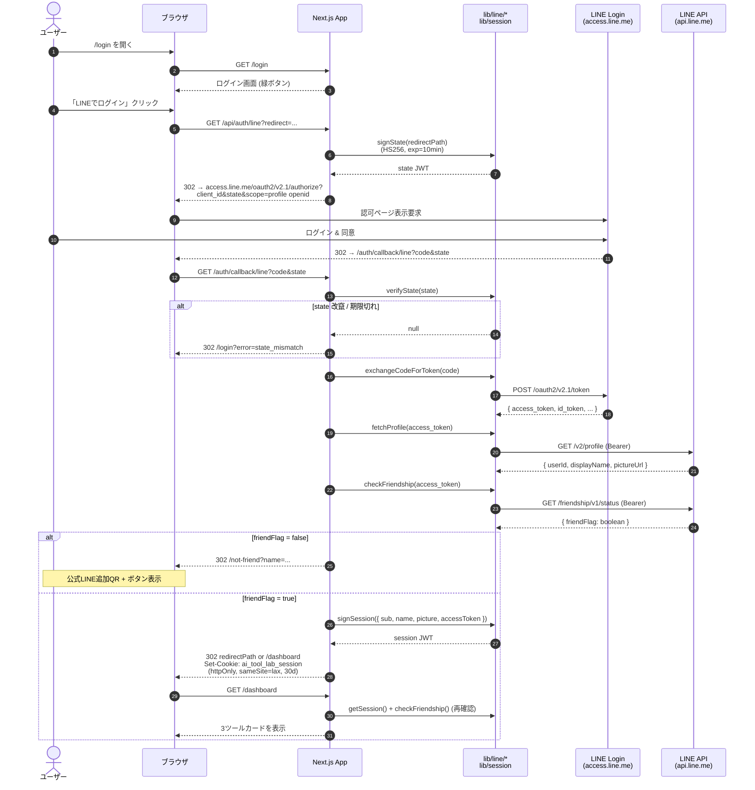
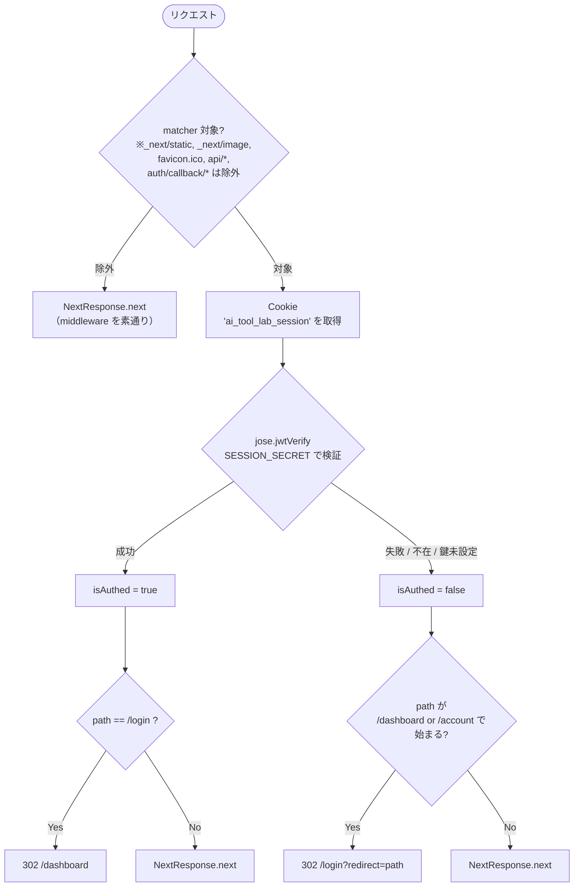
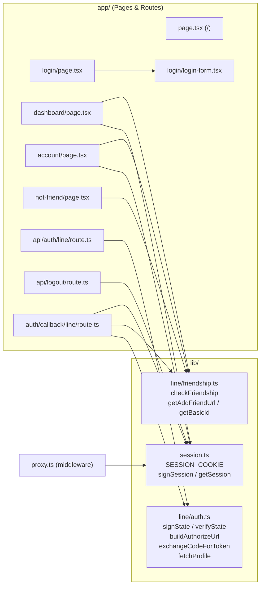
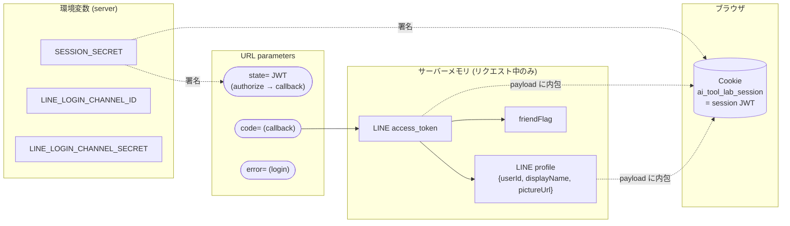

# アーキテクチャ図

> Mermaid を使った実装ベースのアーキテクチャ図集。
> 詳細仕様は [`OVERVIEW.md`](./OVERVIEW.md)、セットアップは [`README.md`](./README.md) を参照。

---

## 1. システム全体（俯瞰図）

ユーザー / 本サイト（Next.js 16）/ LINE プラットフォーム / 外部AIツールの関係。

```mermaid
flowchart LR
    User([ユーザー<br/>ブラウザ / LINEアプリ内ブラウザ])

    subgraph App["ai-tool-lab-auth (Next.js 16 / Vercel)"]
        direction TB
        Pages["Pages<br/>/ /login /dashboard<br/>/account /not-friend"]
        ApiAuth["GET /api/auth/line"]
        ApiCb["GET /auth/callback/line"]
        ApiLogout["POST /api/logout"]
        Proxy["proxy.ts<br/>(route guard)"]
        LibAuth["lib/line/auth.ts"]
        LibFriend["lib/line/friendship.ts"]
        LibSession["lib/session.ts<br/>SESSION_COOKIE"]
        Manuals[("public/manuals/*.pdf")]
    end

    subgraph LINE["LINE Platform"]
        direction TB
        LineLogin["LINE Login<br/>access.line.me<br/>api.line.me/v2/profile"]
        LineMsg["Messaging API<br/>api.line.me/friendship/v1/status"]
        OA["公式LINEアカウント<br/>AIツールラボ"]
    end

    subgraph Tools["外部AIツール (別 Vercel デプロイ)"]
        Meta["Meta広告分析改善ツール"]
        SEO["SEO分析改善ツール"]
        Gmail["Gmail簡単管理ツール"]
    end

    User -->|HTTPS| Pages
    User -->|HTTPS| ApiAuth
    User -->|HTTPS| ApiCb
    User -->|HTTPS| ApiLogout

    Pages --> Proxy
    Proxy --> LibSession

    ApiAuth --> LibAuth
    ApiCb --> LibAuth
    ApiCb --> LibFriend
    ApiCb --> LibSession
    Pages --> LibSession
    Pages --> LibFriend
    Pages --> Manuals

    LibAuth -.OAuth 2.0.-> LineLogin
    LibFriend -.friendship status.-> LineMsg
    User -.友だち追加.-> OA

    Pages -.外部リンク (target=_blank).-> Meta
    Pages -.外部リンク.-> SEO
    Pages -.外部リンク.-> Gmail
```

---

## 2. 認証シーケンス（OAuth + friendship）

ログイン開始から `/dashboard` 到達まで（または `/not-friend` 分岐まで）の通信フロー。



---

## 3. ルート保護（`proxy.ts`）の判定フロー

Next.js 16 の **proxy（旧 middleware）** が各リクエストで何を判定しているか。



ポイント:

- 認証判定は JWT の検証だけ。DB 参照なし → ステートレス
- `SESSION_SECRET` 未設定だと `isAuthed` が常に `false` になり、保護ページは全て `/login` へ
- 既ログイン状態で `/login` を踏むと自動で `/dashboard` へ進む

---

## 4. モジュール依存図

ファイルレベルの依存関係。`@/*` パスエイリアスはリポジトリルートを指す。



---

## 5. データ・トークンの流れ

何がどこに保存され、どこを通るか。



注意点:

- LINE access_token は **セッション JWT の payload** に格納されて Cookie で運ばれる（`/dashboard` での再 friendship 判定に使うため）
- `SESSION_SECRET` が漏れると state も session も偽造可能になるため、本番では確実にローテーション可能な鍵管理を行うこと
- DB やセッションストアは存在せず、**全てステートレス**

---

## 6. 凡例

| 記号 | 意味 |
|---|---|
| 実線矢印 | HTTP リクエスト・関数呼び出し（同期的依存） |
| 点線矢印 | 外部サービスへの通信 / 影響関係 |
| 二重円 (`actor`) | ヒトのユーザー |
| `[(...)]` | データストア・永続化要素 |
| `subgraph` | 同一の信頼境界・物理境界に属するもの |
